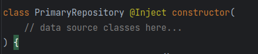
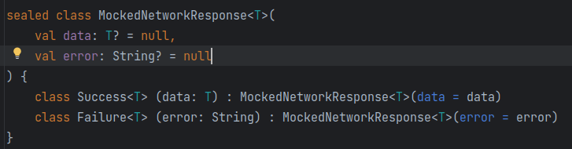
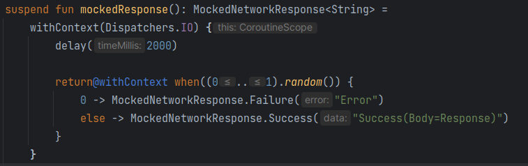

<!-- ABOUT THE PROJECT -->
## About The Project

In this project, I was tasked with creating a button, that when pushed, would return a mock response object after a delay. My Ui needed to be responsive and change itself according to the current state of the app.

While I'm aware this project is very simple and can be completed with a single file, I decided to treat this as an enterprise level app in order to show my current knowledge of app architecture.
I've done my best here to follow the recommended app architecture from Google, which includes building a ui layer and a data layer with MVVM.

## Data Layer

Usually our repository class would have dependencies that would do the heavy lifting for making requests to a data source. However, since we are generating a mocked response, it didn't make sense to make these dependencies.

Using Kotlin's sealed classes feature, I added this class that can act as an all purpose container for both successful and unsuccessful responses from the data source.

This member function is used by the repository to mock our response when called. It uses withContext() to execute this function off the main thread.

## UI Layer

Our view-model class receives a reference to the repository instance. We also wrap our uiState in a StateFlow so that we can emit all of its updates to its collectors in the Ui.

Here is our data object for representing the ui state. It also uses sealed classes to communicate what the overall state of the Ui should be.

Next, you will see that the following member function of the view-model is used to call the mock function from the repository, and update the ui state accordingly with the results.

Finally, the ui state is observed in the composable that represents the screen being looked at. Our viewmodel function above is called by our Button composable.

